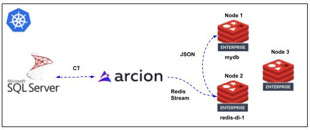
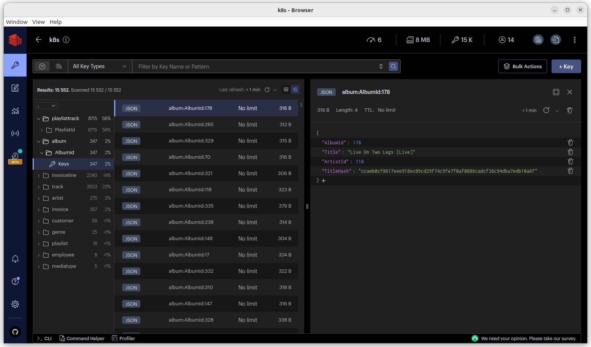

# Redis Data Integration with the Arcion Replicant

## Contents
1.  [Summary](#summary)
2.  [Features](#features)
3.  [Prerequisites](#prerequisites)
4.  [Installation](#installation)
5.  [Usage](#usage)
6.  [Architecture](#architecture)
7.  [Results](#results)


## Summary <a name="summary"></a>
This is a set of bash and K8s resource files for building a local K8s (Kind) demo environment for Redis and Microsoft SQL (MSSQL) integration via Change Tracking (CT).

## Features <a name="features"></a>
- Builds out a full Redis DI environment to include:  Redis Cluster, MSSQL in CT mode, Redis DI (RDI), and the Arcion Replicant.

## Prerequisites <a name="prerequisites"></a>
- Ubuntu 20.x or higher
- kind
- kubectl
- docker

## Installation <a name="installation"></a>
```bash
git clone https://github.com/Redislabs-Solution-Architects/rdi-arcion-k8s.git && cd rdi-arcion-k8s
```

## Usage <a name="usage"></a>
```bash
./start.sh
```
```bash
./stop.sh
```

## Architecture <a name="architecture"></a>
  

## Results <a name="results"></a>
### K8s Cluster
```bash
kubectl get nodes
```

```text
NAME                                     STATUS   ROLES           AGE   VERSION
joeywhelan-redis-cluster-control-plane   Ready    control-plane   26m   v1.27.3
joeywhelan-redis-cluster-worker          Ready    <none>          26m   v1.27.3
joeywhelan-redis-cluster-worker2         Ready    <none>          26m   v1.27.3
joeywhelan-redis-cluster-worker3         Ready    <none>          26m   v1.27.3
```
### Redis Environment
```bash
kubectl -n re get all
```
```text
NAME                                             READY   STATUS    RESTARTS   AGE
pod/mycluster-0                                  2/2     Running   0          23m
pod/mycluster-1                                  2/2     Running   0          17m
pod/mycluster-2                                  2/2     Running   0          11m
pod/mycluster-services-rigger-69db998dff-5pfsv   1/1     Running   0          23m
pod/rdi-cli                                      1/1     Running   0          6m22s
pod/redis-enterprise-operator-5db5c6888d-qjsdw   2/2     Running   0          24m

NAME                               TYPE           CLUSTER-IP      EXTERNAL-IP   PORT(S)             AGE
service/admission                  ClusterIP      10.96.52.243    <none>        443/TCP             24m
service/mycluster                  ClusterIP      10.96.120.114   <none>        9443/TCP,8001/TCP   23m
service/mycluster-prom             ClusterIP      None            <none>        8070/TCP            23m
service/mycluster-ui               ClusterIP      10.96.206.35    <none>        8443/TCP            23m
service/mydb-load-balancer         LoadBalancer   10.96.7.148     172.21.0.10   12000:31426/TCP     6m25s
service/redis-di-1-load-balancer   LoadBalancer   10.96.137.83    172.21.0.11   13000:32327/TCP     4m59s

NAME                                        READY   UP-TO-DATE   AVAILABLE   AGE
deployment.apps/mycluster-services-rigger   1/1     1            1           23m
deployment.apps/redis-enterprise-operator   1/1     1            1           24m

NAME                                                   DESIRED   CURRENT   READY   AGE
replicaset.apps/mycluster-services-rigger-69db998dff   1         1         1       23m
replicaset.apps/redis-enterprise-operator-5db5c6888d   1         1         1       24m

NAME                         READY   AGE
statefulset.apps/mycluster   3/3     23m
```
### Redis Cluster
```bash
kubectl -n re exec mycluster-0 -c redis-enterprise-node -- rladmin status
```
```text
CLUSTER NODES:
NODE:ID ROLE   ADDRESS    EXTERNAL_ADDRESS HOSTNAME    SHARDS CORES FREE_RAM        PROVISIONAL_RAM VERSION  STATUS
*node:1 master 10.244.3.4 10.244.3.4       mycluster-0 1/100  12    47.71GB/62.46GB 36.37GB/51.21GB 6.4.2-94 OK    
node:2  slave  10.244.1.4 10.244.1.4       mycluster-1 1/100  12    47.71GB/62.46GB 36.37GB/51.21GB 6.4.2-94 OK    
node:3  slave  10.244.2.4 10.244.2.4       mycluster-2 0/100  12    47.71GB/62.46GB 36.46GB/51.21GB 6.4.2-94 OK    

DATABASES:
DB:ID NAME       TYPE  MODULE STATUS SHARDS PLACEMENT REPLICATION PERSISTENCE ENDPOINT                                        
db:1  mydb       redis yes    active 1      dense     disabled    disabled    redis-12000.mycluster.re.svc.cluster.local:12000
db:2  redis-di-1 redis yes    active 1      dense     disabled    aof         redis-13000.mycluster.re.svc.cluster.local:13000

ENDPOINTS:
DB:ID     NAME              ID                   NODE       ROLE       SSL      
db:1      mydb              endpoint:1:1         node:1     single     No       
db:2      redis-di-1        endpoint:2:1         node:2     single     No       

SHARDS:
DB:ID       NAME         ID       NODE    ROLE    SLOTS    USED_MEMORY   STATUS 
db:1        mydb         redis:1  node:1  master  0-16383  7.79MB        OK     
db:2        redis-di-1   redis:2  node:2  master  0-16383  2.98MB        OK
```
### MSSQL Environment
```bash
kubectl -n ms get all
```
```text
NAME          READY   STATUS    RESTARTS   AGE
pod/mssql-0   1/1     Running   0          5m40s

NAME                    TYPE           CLUSTER-IP      EXTERNAL-IP   PORT(S)          AGE
service/mssql-service   LoadBalancer   10.96.208.225   172.21.0.12   1433:31994/TCP   5m40s

NAME                     READY   AGE
statefulset.apps/mssql   1/1     5m40s
```
### Arcion Replicant Environment
```bash
kubectl -n arcion get all
```
```text
NAME                             READY   STATUS    RESTARTS   AGE
pod/replicant-5dbb4d89fb-qffxj   1/1     Running   0          2m10s

NAME                        READY   UP-TO-DATE   AVAILABLE   AGE
deployment.apps/replicant   1/1     1            1           2m10s

NAME                                   DESIRED   CURRENT   READY   AGE
replicaset.apps/replicant-5dbb4d89fb   1         1         1       2m10s
```
### RDI status
```bash
kubectl -n re exec -it rdi-cli -- redis-di status --rdi-host redis-di-1-load-balancer --rdi-port 13000 --rdi-password YrLlKlalRR4XMXZIMX7S
```
```text
Status of Redis Data Integration version 0.101.3 on redis-di-1-load-balancer:13000

started

Engine State
Sync mode: initial snapshot
Last data retrieved (source): 08/09/2023 15:12:44.000000 
Last data updated (target): 08/09/2023 15:12:44.480737 
Last snapshot:
  Number of processes: 4
  Start: 08/09/2023 15:12:39.427140 
  End: 08/09/2023 15:12:38.986975 

Connections
+--------+-------+--------------------+-------+----------+---------+----------+-----------+
| Name   | Type  | Host(s)            | Port  | Database | User    | Password | Status    |
+--------+-------+--------------------+-------+----------+---------+----------+-----------+
| target | redis | mydb-load-balancer | 12000 |          | default | ******   | connected |
+--------+-------+--------------------+-------+----------+---------+----------+-----------+

Clients
+-----------+------------------+--------------+-----------+------------+---------+
| ID        | ADDR             | Name         | Age (sec) | Idle (sec) | User    |
+-----------+------------------+--------------+-----------+------------+---------+
| 757002000 | 10.244.3.7:59412 | Arcion       | 43        | 13         | default |
| 760002000 | 10.244.3.7:59434 | Arcion       | 43        | 13         | default |
| 763002000 | 10.244.3.7:59466 | Arcion       | 43        | 13         | default |
| 766002000 | 10.244.3.7:59498 | Arcion       | 43        | 13         | default |
| 769002000 | 10.244.3.7:59526 | Arcion       | 43        | 13         | default |
| 772002000 | 10.244.3.7:59562 | Arcion       | 43        | 13         | default |
| 775002000 | 10.244.3.7:59580 | Arcion       | 43        | 13         | default |
| 778002000 | 10.244.3.7:59602 | Arcion       | 43        | 13         | default |
| 781002000 | 10.244.3.7:59632 | Arcion       | 43        | 13         | default |
| 784002000 | 10.244.3.7:59654 | Arcion       | 43        | 13         | default |
| 871002000 | 10.244.3.5:43166 | redis-di-cli | 0         | 0          | default |
| 758002001 | 10.244.3.7:59418 | Arcion       | 43        | 13         | default |
| 761002001 | 10.244.3.7:59446 | Arcion       | 43        | 13         | default |
| 764002001 | 10.244.3.7:59478 | Arcion       | 43        | 13         | default |
| 767002001 | 10.244.3.7:59508 | Arcion       | 43        | 13         | default |
| 770002001 | 10.244.3.7:59536 | Arcion       | 43        | 13         | default |
| 773002001 | 10.244.3.7:59564 | Arcion       | 43        | 13         | default |
| 776002001 | 10.244.3.7:59588 | Arcion       | 43        | 13         | default |
| 779002001 | 10.244.3.7:59618 | Arcion       | 43        | 13         | default |
| 782002001 | 10.244.3.7:59642 | Arcion       | 43        | 13         | default |
| 845002001 | 10.244.3.7:42204 | Arcion       | 13        | 13         | default |
| 759002002 | 10.244.3.7:59426 | Arcion       | 43        | 13         | default |
| 762002002 | 10.244.3.7:59458 | Arcion       | 43        | 13         | default |
| 765002002 | 10.244.3.7:59486 | Arcion       | 43        | 13         | default |
| 768002002 | 10.244.3.7:59512 | Arcion       | 43        | 13         | default |
| 771002002 | 10.244.3.7:59546 | Arcion       | 43        | 13         | default |
| 774002002 | 10.244.3.7:59574 | Arcion       | 43        | 13         | default |
| 777002002 | 10.244.3.7:59592 | Arcion       | 43        | 13         | default |
| 780002002 | 10.244.3.7:59626 | Arcion       | 43        | 13         | default |
| 783002002 | 10.244.3.7:59644 | Arcion       | 43        | 13         | default |
| 846002002 | 10.244.3.7:42210 | Arcion       | 13        | 13         | default |
+-----------+------------------+--------------+-----------+------------+---------+

Ingested Data Streams
+----------------------------+-------+---------+----------+---------+---------+----------+----------+
| Name                       | Total | Pending | Inserted | Updated | Deleted | Filtered | Rejected |
+----------------------------+-------+---------+----------+---------+---------+----------+----------+
| data:Chinook.MediaType     | 5     | 0       | 5        | 0       | 0       | 0        | 0        |
| data:Chinook.Customer      | 59    | 0       | 59       | 0       | 0       | 0        | 0        |
| data:Chinook.PlaylistTrack | 8715  | 0       | 8715     | 0       | 0       | 0        | 0        |
| data:Chinook.Album         | 347   | 0       | 347      | 0       | 0       | 0        | 0        |
| data:Chinook.Genre         | 25    | 0       | 25       | 0       | 0       | 0        | 0        |
| data:Chinook.Employee      | 8     | 0       | 8        | 0       | 0       | 0        | 0        |
| data:Chinook.Track         | 3503  | 0       | 3503     | 0       | 0       | 0        | 0        |
| data:Chinook.Invoice       | 412   | 0       | 357      | 0       | 0       | 55       | 0        |
| data:Chinook.InvoiceLine   | 2240  | 0       | 2240     | 0       | 0       | 0        | 0        |
| data:Chinook.Artist        | 275   | 0       | 275      | 0       | 0       | 0        | 0        |
| data:Chinook.Playlist      | 18    | 0       | 18       | 0       | 0       | 0        | 0        |
+----------------------------+-------+---------+----------+---------+---------+----------+----------+

Performance Statistics per Batch (batch size: 2000)
  Last run(s) duration (ms): [4]
  Average run duration (ms): 97.84
```
### RedisInsight Screenshot
 